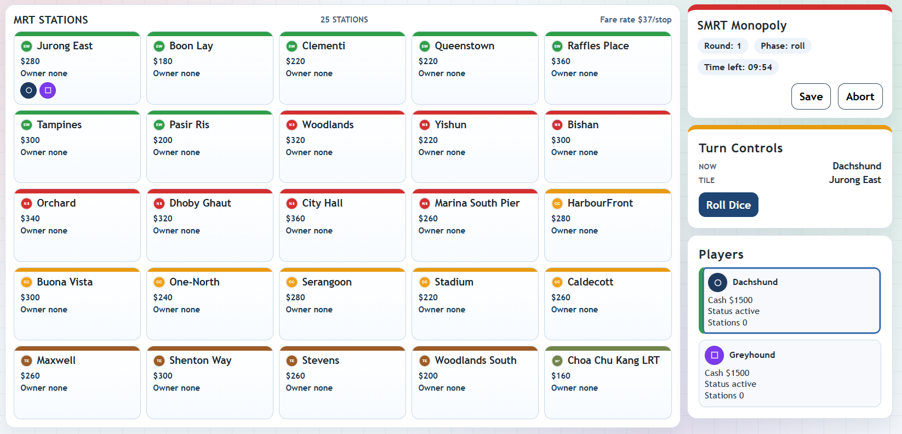

# SMRT Monopoly (Web V1)

Monopoly-like digital board game inspired by key stations on the Singapore SMRT network.



## V1 Scope

- 2-4 players
- Desktop-first web app
- Local pass-and-play (single device)
- Key SMRT station properties
- Faithful SMRT-map themed interface with local line badges/logos
- Player-voted end condition:
  - Last player not bankrupt
  - Fixed rounds (highest net worth wins)
  - Target wealth

## Tech Stack

- React + TypeScript + Vite
- Vitest + React Testing Library
- Playwright (e2e)

## Run

```bash
npm install
npm run dev
```

## Verification

```bash
npm run lint
npm run test
npm run build
PLAYWRIGHT_BROWSERS_PATH=/tmp/pw-browsers npm run test:e2e -- tests/e2e/pass-and-play.spec.ts
```

## Project Structure

- `src/assets/smrt`: local SMRT branding assets (logo + line badges)
- `src/game`: domain types, constants, rules, reducer, persistence
- `src/features/setup`: setup flow and majority-vote end-condition selection
- `src/features/game`: board, controls, pass-device overlay, game shell
- `src/features/results`: winner and ranking presentation
- `tests/e2e`: Playwright scenario coverage
- `docs/plans`: approved design and implementation plan
